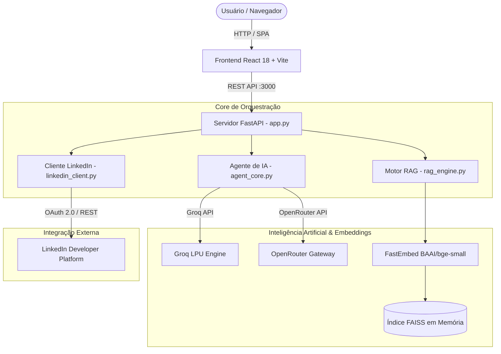

# LinkedIn Viral Content AI 🚀

[](https://fastapi.tiangolo.com)
[](https://reactjs.org)
[](https://vitejs.dev)
[](https://github.com/facebookresearch/faiss)
[](https://github.com/qdrant/fastembed)
[](https://tailwindcss.com)
[](https://developer.linkedin.com)
[](LICENSE)

> Ecossistema full-stack de alta performance para construção de autoridade técnica e maximização de engajamento no LinkedIn, combinando **RAG vetorial da documentação oficial da API do LinkedIn**, orquestração inteligente multi-perspectiva (**Groq** e **OpenRouter**) e uma interface moderna em **React 18 + Vite** no estilo Lovable Dark Mode.

---

## 📑 Sumário

- [Visão Geral](#-visão-geral)
- [Principais Funcionalidades](#-principais-funcionalidades)
- [Arquitetura do Ecossistema](#-arquitetura-do-ecossistema)
- [Módulos da Interface (8 Páginas)](#-módulos-da-interface-8-páginas)
- [Rotas da API FastAPI](#-rotas-da-api-fastapi)
- [Estrutura de Diretórios](#-estrutura-de-diretórios)
- [Pré-requisitos e Instalação](#-pré-requisitos-e-instalação)
- [Configuração de Ambiente (.env)](#-configuração-de-ambiente-env)
- [Como Executar](#-como-executar)
- [Auditoria Automatizada do Sistema](#-auditoria-automatizada-do-sistema)
- [Segurança e Compliance](#-segurança-e-compliance)
- [Autor](#-autor)

---

## 🌟 Visão Geral

O **LinkedIn Viral Content AI** resolve o problema de criação de conteúdo consistente e com alto engajamento técnico para líderes, desenvolvedores e profissionais de tecnologia. 

Ao invés de gerar textos genéricos, o sistema:
1. Consulta uma base vetorial FAISS indexada com o manual oficial da **LinkedIn Marketing Developer Platform** (especificações da Posts API, Images API, headers `LinkedIn-Version: 202602` e `X-Restli-Protocol-Version: 2.0.0`).
2. Gera narrativas a partir de **3 perspectivas complementares** (Otimista, Crítica e Pragmática) com ganchos virais (*hooks*) pré-otimizados para prender a atenção antes do botão *"Ver mais"*.
3. Cria prompts visuais conceituais em inglês para geração de imagens ultra-realistas.
4. Oferece um **Agente Consultivo Natural**: conversa, tira dúvidas e só elabora posts estruturados quando expressamente solicitado, fornecendo barra de publicação rápida (*Copiar* e *Publicar no LinkedIn*).
5. Opera em dois modos seguros de publicação: **Simulação** (sandbox local com validação de payload e geração de URN realista) e **Live** (disparo real autenticado via OAuth 2.0).

---

## ⚡ Principais Funcionalidades

- **Base de Conhecimento RAG Vetorial**: Indexação semântica com FastEmbed (`BAAI/bge-small-en-v1.5`) e FAISS em memória, cobrindo endpoints oficiais, escopos (`w_member_social`, `openid`, `profile`) e fluxo de upload de mídia em 3 etapas (`initializeUpload` ➔ envio binário PUT ➔ anexação de `image_urn`).
- **Engines de IA Intercambiáveis**:
  - **Groq**: Inferência ultrarrápida via `openai/gpt-oss-120b` ou modelos LLaMA.
  - **OpenRouter**: Acesso a modelos topo de linha (`meta-llama/llama-3.3-70b-instruct`, etc.).
- **Perspectivas Contrastantes**:
  - 🚀 **Otimista**: Foco no potencial transformador, saltos de escala e visão de futuro.
  - ⚠️ **Crítica**: Foco em pontos cegos, custos ocultos e o que ninguém está dizendo.
  - 🔧 **Pragmática**: Foco em ROI, trade-offs de implementação e o que fazer hoje na prática.
- **Auditoria de Posts em Tempo Real**: Cálculo de nota de viralidade (0 a 100), força do gancho inicial, tempo estimado de leitura e sugestões cirúrgicas de melhoria.
- **Gerador de Carrosséis**: Roteirização completa de slides com dicas visuais e chamadas para ação (CTA).
- **Publicação Segura**: Validação estrita de URN do autor e cabeçalhos do LinkedIn antes de qualquer chamada remota.
- **Resiliência Offline Local**: Suporte completo a armazenamento local (`localStorage`) para rascunhos, calendário e histórico de conversas, sem dependência obrigatória de serviços de terceiros em nuvem.

---

## 🏗️ Arquitetura do Ecossistema



---

## 💻 Módulos da Interface (8 Páginas)

A aplicação conta com uma interface moderna em Dark Mode, acessível via barra lateral com identificação do autor:

| Rota | Página | Descrição |
| :--- | :--- | :--- |
| `/` | **Dashboard** | Métricas de alcance, estatísticas de rascunhos, ações rápidas e lista dos últimos posts criados. |
| `/chat` | **Chat Consultivo** | Assistente de estratégia para LinkedIn. Conversa naturalmente e gera posts com barra de ação rápida (*Copiar* e *Publicar*). |
| `/templates` | **Biblioteca de Templates** | Dezenas de estruturas comprovadas com filtros por categoria (Histórias, Tutoriais, Provocativos, etc.). |
| `/analyze` | **Auditoria de Posts** | Analisador heurístico com score viral, tempo de leitura e reescrita de gancho. |
| `/carousel` | **Gerador de Carrossel** | Criação e ordenação de slides para publicação em formato carrossel/documento. |
| `/calendar` | **Calendário Editorial** | Planejamento e organização de publicações em visualização mensal e semanal. |
| `/gallery` | **Galeria de Mídias** | Histórico e gerenciamento de artes conceituais e imagens para os posts. |
| `/linkedin` | **Painel do LinkedIn** | Central de autenticação OAuth 2.0, verificação de URN do perfil e alternância entre Simulação e Live. |

---

## 🔌 Rotas da API FastAPI

Todas as operações estão disponíveis via endpoints REST padronizados:

- `GET /` — Serve a aplicação SPA compilada em React 18 + Vite.
- `GET /api/status` — Retorna a telemetria do sistema (status dos motores LLM, RAG indexado e credenciais do LinkedIn).
- `POST /api/chat` — Interação multi-turno com o agente conversacional.
- `POST /api/generate` — Gera o pacote triplo de perspectivas (Otimista, Crítica e Pragmática) com prompts de imagem.
- `POST /api/publish` — Dispara publicações via API oficial do LinkedIn (`mode: "live"`) ou sandbox (`mode: "simulation"`).
- `POST /api/upload-image` — Upload binário de imagens com registro de URN na API de Imagens do LinkedIn.
- `POST /api/rag-query` — Busca semântica vetorial na base de conhecimento oficial.
- `POST /api/config` — Atualização a quente de configurações e chaves no `.env`.
- `GET /auth/linkedin` — Redireciona para autorização de consentimento OAuth 2.0.
- `GET /callback` — Recebe o código OAuth e gera o Access Token.

---

## 📁 Estrutura de Diretórios

```
RAG_LINKEDIN/
├── agent_core.py             # Núcleo de orquestração de IA (Groq/OpenRouter, Chat e Prompts)
├── app.py                    # Servidor FastAPI com rotas REST e SPA fallback
├── audit_all_features.py     # Suíte de auditoria completa automatizada (30/30 testes)
├── config.py                 # Gestão de variáveis de ambiente e caminhos base
├── linkedin_client.py        # Cliente oficial da API do LinkedIn (OAuth 2.0, Upload e Posts)
├── rag_engine.py             # Motor RAG com FastEmbed e FAISS
├── quick_test.py             # Teste de validação rápida
├── test_system.py            # Testes de integração
├── ESTADO_PROJETO.md         # Documentação de rastreabilidade do projeto
├── README.md                 # Esta documentação
├── .env.example              # Modelo seguro de variáveis de ambiente
├── .gitignore                # Proteção contra commit de chaves e dados sensíveis
│
├── frontend/                 # Aplicação React 18 + Vite + TailwindCSS + shadcn/ui
│   ├── src/
│   │   ├── components/       # Componentes de UI, Chat, Layout e Sidebar
│   │   ├── contexts/         # Contextos React (AuthContext)
│   │   ├── hooks/            # Hooks customizados (useCalendarPosts, useLocalStorage, etc.)
│   │   ├── pages/            # 8 páginas operacionais completas
│   │   └── types/            # Tipagens TypeScript do sistema
│   └── dist/                 # Build otimizado servido pelo FastAPI
│
└── static/                   # Assets estáticos auxiliares
```

---

## 📦 Pré-requisitos e Instalação

### Pré-requisitos
- **Python 3.10+** (Testado no Python 3.13)
- **Node.js 18+** e **npm** (para eventuais compilações do frontend)
- Git instalado

### 1. Clonar o Repositório
```bash
git clone https://github.com/claudemirpc68-del/Rag-Linkedin.git
cd Rag-Linkedin
```

### 2. Instalar Dependências do Python
```bash
pip install fastapi uvicorn requests python-dotenv langchain-community fastembed faiss-cpu pydantic
```

---

## ⚙️ Configuração de Ambiente (.env)

Copie o arquivo de exemplo e defina suas credenciais:

```bash
cp .env.example .env
```

Conteúdo esperado no `.env`:

```ini
# Provedores de LLM
GROQ_API_KEY=gsk_sua_chave_groq_aqui
GROQ_MODEL=openai/gpt-oss-120b

OPENROUTER_API_KEY=sk-or-v1-sua_chave_openrouter_aqui
OPENROUTER_MODEL=meta-llama/llama-3.3-70b-instruct

# LinkedIn Developer Platform (Opcional para modo Live)
LINKEDIN_CLIENT_ID=seu_client_id
LINKEDIN_CLIENT_SECRET=seu_client_secret
LINKEDIN_ACCESS_TOKEN=seu_access_token_aqui
LINKEDIN_AUTHOR_URN=urn:li:person:seu_id
LINKEDIN_API_VERSION=202602

# Configurações do Servidor
PORT=3000
HOST=127.0.0.1
```

> **Nota:** Caso não configure as chaves do LinkedIn, o sistema operará com 100% de funcionalidade no **Modo Simulação**, gerando URNs realistas sem realizar disparos remotos.

---

## 🚀 Como Executar

### 1. Iniciar o Servidor Integrado (FastAPI + React)
```bash
python -m uvicorn app:app --host 127.0.0.1 --port 3000
```

Abra no seu navegador: **[http://127.0.0.1:3000](http://127.0.0.1:3000)**

Documentação Swagger interativa da API: **[http://127.0.0.1:3000/docs](http://127.0.0.1:3000/docs)**

### 2. Compilação do Frontend (opcional se alterar código em `frontend/src/`)
```bash
cd frontend
node ./node_modules/vite/bin/vite.js build
```

---

## 🛡️ Auditoria Automatizada do Sistema

O projeto conta com uma ferramenta completa de diagnóstico [audit_all_features.py](audit_all_features.py) que testa de forma autônoma:
- Configurações e variáveis de ambiente;
- Motor RAG (busca semântica e carregamento do índice FAISS);
- Todas as capacidades da IA (chat consultivo, geração sob demanda, 3 perspectivas, prompts visuais, auditoria de post e carrossel);
- Cliente do LinkedIn (geração de OAuth URL, cabeçalhos Restli 2.0.0 e simulação de publicação);
- Todos os endpoints HTTP do FastAPI;
- Integridade do build do React 18 e ausência de badges externos.

Para rodar a suíte a qualquer momento:
```bash
python audit_all_features.py
```

Resultado atual da suíte:
```
  • Total de Testes Executados: 30
  • Testes Bem-Sucedidos:       30 (100%)
  • Falhas Detectadas:         0
  • Status:                    APROVADO
```

---

## 🔒 Segurança e Compliance

- **Proteção de Chaves de API**: O arquivo `.gitignore` bloqueia o rastreamento de `.env`, `.env.local` e credenciais sensíveis.
- **Governança de Publicação**: Por padrão, o sistema opera no modo **Simulação**, evitando postagens acidentais sem aprovação explícita.
- **Respeito aos Limites da API**: Utiliza a versão `202602` com o protocolo `Restli 2.0.0` em conformidade com as diretrizes oficiais do LinkedIn.

---

## ⚖️ Termo de Isenção de Responsabilidade & Licença

- **Aviso Legal e Isenção de Responsabilidade:** Consulte [DISCLAIMER.md](DISCLAIMER.md) para os termos completos de isenção sobre uso indevido, políticas de IA e conformidade com os termos de serviço do LinkedIn.
- **Licença de Uso:** Distribuído sob a licença [MIT](LICENSE). Consulte o arquivo `LICENSE` para detalhes legais.

---

## 👤 Autor

**Claudemir Pedroso Cubas**  
- GitHub: [@claudemirpc68-del](https://github.com/claudemirpc68-del)
- Projeto: [claudemirpc68-del/Rag-Linkedin](https://github.com/claudemirpc68-del/Rag-Linkedin)
